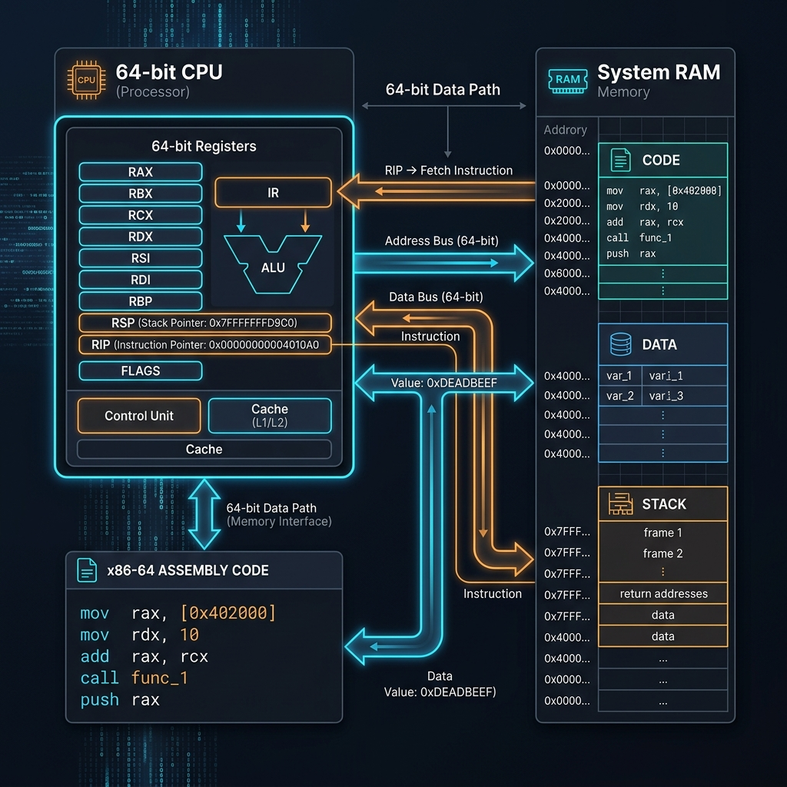
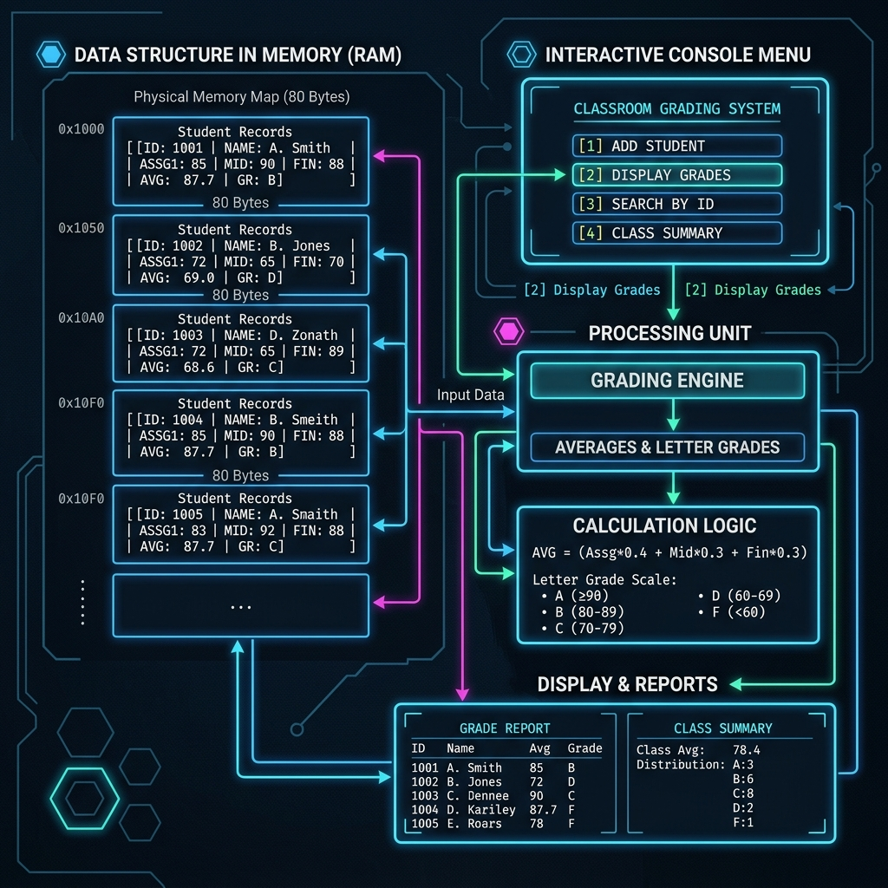
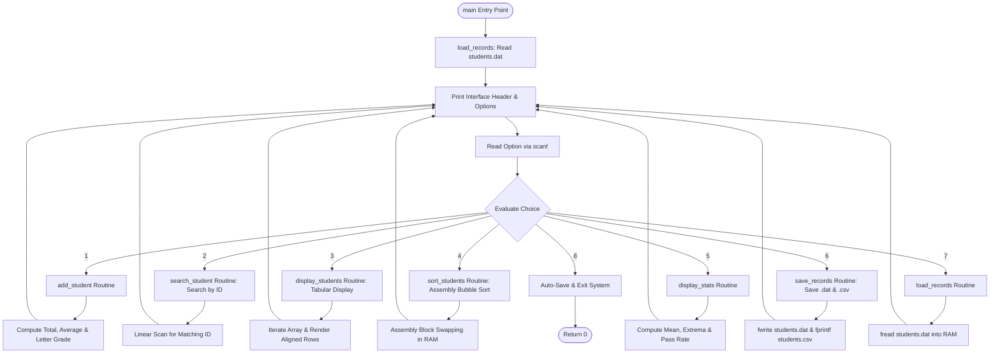

# Classroom Grading System: Technical Development Manual & x86_64 Assembly Reference Guide

## 1. Overview & System Objectives

This technical manual details the software architecture, memory layout, register management, file persistence routines, in-memory sorting algorithms, and execution workflow of an enhanced Classroom Grading System constructed in 64-bit x86 Assembly (`x86_64`). 

The application provides a persistent console command loop that accepts student records, searches records by unique identification numbers, computes score totals and integer averages, classifies letter grades against standard thresholds, sorts records in memory using pure assembly, generates aggregate performance analytics, and persists data across sessions via binary database files (`students.dat`) and CSV reports (`students.csv`).

The application was designed for native execution on 64-bit Microsoft Windows environments using standard C runtime (`ucrtbase.dll`) linkages provided via GCC and the GNU Assembler (`as`).

---

## 2. Fundamentals of Low-Level x86_64 Execution

### 2.1 The Machine Model
At higher levels of abstraction (such as C, Python, or Java), software operations are expressed using structured control loops, automatic stack frames, and symbolic variable names. At the hardware boundary, execution is driven directly by processor instructions manipulating physical memory addresses and internal hardware storage locations known as **registers**.


*Figure 1: Hardware execution model illustrating interaction between CPU registers, system RAM segments, and assembly instruction streams.*

### 2.2 Core Hardware Components
1. **CPU Registers**: Fixed-width, high-speed storage slots located directly on the processor silicon. In 64-bit x86 mode, general-purpose registers are 64 bits (8 bytes) wide (`rax`, `rcx`, `rdx`, `rbx`, `rsi`, `rdi`, `rsp`, `rbp`, and `r8` through `r15`).
2. **Main System Memory (RAM)**: Organized into distinct logical segments:
   - `.text`: Read-only executable machine instructions.
   - `.data`: Initialized static and global variables.
   - `.bss`: Uninitialized static storage allocated at program startup.
3. **The Call Stack**: A dynamic data structure in RAM pointed to by the stack pointer register (`rsp`). It manages function frames, local variables, return addresses, and external procedure arguments.

---

## 3. Memory Architecture & Data Representation

### 3.1 Student Record Layout
To store record arrays without high-level structure primitives, data fields are organized using fixed byte offsets. Each student record requires exactly **80 bytes** of memory.

| Field Offset | Field Name | Data Type | Storage Size | Purpose |
|---|---|---|---|---|
| `+0` | Student ID | Signed 64-bit Integer | 8 Bytes | Unique numeric student identifier |
| `+8` | Student Name | Null-Terminated String | 32 Bytes | Alphanumeric student name buffer |
| `+40` | Assignment Score | Signed 64-bit Integer | 8 Bytes | Assignment grade ($0 - 100$) |
| `+48` | Exam Score | Signed 64-bit Integer | 8 Bytes | Final exam grade ($0 - 100$) |
| `+56` | Total Score | Signed 64-bit Integer | 8 Bytes | Cumulative total ($0 - 200$) |
| `+64` | Average Score | Signed 64-bit Integer | 8 Bytes | Computed average ($0 - 100$) |
| `+72` | Letter Grade | ASCII Character / Quad | 8 Bytes | Grade letter (`A`, `B`, `C`, `D`, `F`) |

### 3.2 Array Buffer Allocation
Static buffer space for up to 30 student records ($30 \times 80 = 2,400$ bytes) is allocated in the `.bss` section:

```assembly
.section .bss
student_count:
    .quad 0                     /* 64-bit integer tracking total registered students */
students:
    .space 2400                 /* Contiguous 2,400-byte memory block for records */
```

To calculate the base address of the $i$-th student record, the processor performs index scaling:
$$\text{Record Address} = \text{Base Address of } \texttt{students} + (i \times 80)$$

---

## 4. System Architecture & Control Flow


*Figure 2: Architectural diagram showing control flow between the interactive menu handler, input processors, search module, sorting routines, and file I/O subsystems.*



---

## 5. Subroutine Implementation Details

### 5.1 Student ID Search Module (`search_student`)
Prompted via menu option `[2]`, the search routine executes a 64-bit integer search loop matching user input against `students[i].id`:

```assembly
search_loop:
    cmp rbx, rsi
    jge search_not_found

    mov rax, rbx
    imul rax, RECORD_SIZE
    lea rdi, [rip + students]
    add rdi, rax

    cmp qword ptr [rdi + 0], r10  /* Compare ID at offset 0 with target ID */
    je search_found
```

### 5.2 In-Memory Bubble Sort (`sort_students`)
The sorting routine performs an in-place Bubble Sort directly over the 80-byte record blocks in RAM. The user can select sorting by **Average Score (Descending)** or **Student ID (Ascending)**.

```assembly
swap_records:
    /* Swap 80 bytes between student[j] (RDI) and student[j+1] (R14) */
    xor r15, r15
swap_quad_loop:
    cmp r15, RECORD_SIZE
    jge no_swap

    mov rax, qword ptr [rdi + r15]
    mov rdx, qword ptr [r14 + r15]
    mov qword ptr [rdi + r15], rdx
    mov qword ptr [r14 + r15], rax

    add r15, 8
    jmp swap_quad_loop
```

### 5.3 File Storage Persistence & CSV Export (`save_records` & `load_records`)
Data persistence is achieved by linking C standard I/O library procedures (`fopen`, `fwrite`, `fread`, `fprintf`, `fclose`):

1. **Binary Persistence (`students.dat`)**:
   Writes `student_count` followed by the raw contiguous array block (`students`) to disk via `fwrite`. On startup, `load_records` reads `students.dat` directly back into RAM.

2. **CSV Export (`students.csv`)**:
   Generates a formatted CSV file using `fprintf`.

---

## 6. Technical Engineering Challenges & Resolution

### 6.1 Windows x86_64 Call Stack Alignment
Under the Windows 64-bit ABI standard, callers must guarantee that the stack pointer (`rsp`) is aligned to a **16-byte boundary** prior to issuing any `call` instruction to external library functions (`printf`, `scanf`, `fopen`, `fwrite`, `fread`, `fprintf`, `fflush`).

> [!IMPORTANT]
> **Issue**: When a `call` instruction executes, the CPU automatically pushes an 8-byte return address onto the stack, altering alignment. If `rsp` is not 16-byte aligned at procedure call entry, vector instructions inside CRT libraries trigger hardware segmentation faults (`SIGSEGV`).

**Mathematical Resolution**:
$$(\text{Return Address [8]} + \text{Pushes [8 } \times k\text{]} + N) \pmod{16} = 0$$

### 6.2 Volatile Register Preservation across Procedure Calls
Under Windows x86_64 ABI conventions, registers `rax`, `rcx`, `rdx`, `r8`, `r9`, `r10`, and `r11` are **caller-saved (volatile)**. Any invocation of external C library functions can overwrite these registers.

---

## 7. Technical Reference Glossary

| Symbol / Directive | Functional Definition |
|---|---|
| `.intel_syntax noprefix` | Instructs the assembler to parse Intel operand ordering (`instruction destination, source`) without `%` prefixes. |
| `[rip + symbol]` | Position-independent RIP-relative addressing used in 64-bit code for global data symbol resolution. |
| `fopen` / `fclose` | C CRT procedures for opening and closing file handles on disk. |
| `fwrite` / `fread` | C CRT procedures for block binary I/O transfers between RAM buffers and disk files. |
| `fprintf` / `fputs` | C CRT procedures for writing formatted text streams to opened file handles. |
| `cqo` | Sign-extends the 64-bit `RAX` register into the 128-bit `RDX:RAX` register pair prior to 64-bit signed division (`idiv`). |
| `Shadow Space` | Mandatory 32-byte memory allocation reserved by the caller at `[rsp]` for parameter spill space before procedure calls. |
